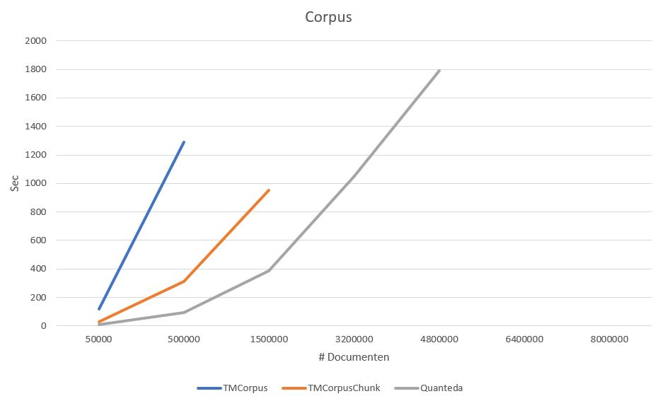

In deze documentatie tonen we aan dat de klassieke [tm-package]() sneller verloopt door middel van parallellisatie. Hiernaast maken we gebruik van een andere package [Quanteda](https://cran.r-project.org/web/packages/quanteda/quanteda.pdf). 

[Quanteda](https://cran.r-project.org/web/packages/quanteda/quanteda.pdf) is een multithreaded package dat gebouwd is bovenop [stringi](), [data.table]() en [Matrix]().
Het is ontworpen als snelle methode voor het omzetten van een corpus van tekst, naar een document by features matrix.
Quanteda zal gebruik maken van zijn eigen ingebouwde methodes om de gecreërde tokens in de document by features matrix te cleanen.

Hieronder ziet u de sequentiele code om een corpus te creëren van het document *docs* met behulp van de tm-package.
Hierbij zal ook de nodige cleaning gedaan worden met behulp van tm_map.
```{r}
TMCorpus <- function() {
  crp <- VCorpus(DataframeSource(docs), readerControl = list(language = "en"))
  
  ##### Define general function to replace strings in corpus
  (crp.replacePattern <- content_transformer(function(x, pattern, replace) gsub(pattern, replace, x)))
  
  ##### Clean unicode characters
  ##### Remove graphical characters
  crp <- tm_map(crp, crp.replacePattern, "[^[:graph:]]", " ")
  
  ##### To lower
  crp <- tm_map(crp, content_transformer(tolower))
  
  ##### Stopword removal
  crp <- tm_map(crp, removeWords, c(stopwords("SMART")))
  
  ##### Stemming
  crp <- tm_map(crp, stemDocument, language = "porter")
  
  ##### All numbers (including numbers as part of a alphanumerical term)
  crp <- tm_map(crp, removeNumbers)
  
  ##### Punctuation
  crp <- tm_map(crp, removePunctuation, preserve_intra_word_dashes = TRUE)
  
  ##### Whitespace
  crp <- tm_map(crp, stripWhitespace)
  
  # SAVE RESULTS
  save(crp, file = "crp.RDa")
  return(crp)
}
```

Om de bovenstaande functie te parallelliseren splitsen we *docs* eerst op in kleinere delen (chunks).
Hierdoor kunnen de verschillende cleaning methodes parallel runnen over meerdere chunks.
We maken bij elke functie gebruik van de doParallel::foreach methode.

Eerst creëren we de parallele cluster. Deze geven we dan mee in onze methode als *cl*.
We maken hier gebruik van 'makeCluster' en 'clusterEvalQ'.
'makeCluster' maakt de parallele cluster aan op basis van het aantal cores dat we meegeven. 
Met 'clusterEvalQ' laden we de tm-package in op elke core.

```{r}
createCorpusCluster <- function() {
  no_cores <- detectCores() 
  cl <- makeCluster(no_cores, outfile = "")
  clusterEvalQ(cl, {
    library("tm")
  })
  return(cl)
}
```

<!-- In TMCorpusChunk parallelliseren we elke cleaning methode over chunks van de corpus die we eerst zullen creëren. -->
Om de chunks te maken splitsen we *docs* op basis van het aantal cores dat we ter beschikking stellen.
Omdat de document id's niet opeenvolgend zijn, hebben we in docs een extra kolom aangemaakt *id*. Deze gebruiken we om op een juiste manier de id's op te splitsen in chuncks.
Op deze manier verwerkt elke core hetzelfde aantal documenten.
Deze resultaten combineren we dan tot 1 grote corpus.
```{r}
TMCorpusChunk <- function() {
  crp <- VCorpus(DataframeSource(docs), readerControl = list(language = "en"))
  cl <- createCorpusCluster()
  ##### Define general function to replace strings in corpus
  (crp.replacePattern <- content_transformer(function(x, pattern, replace) gsub(pattern, replace, x)))
  
  ids <- 1:length(crp)
  no_cores <- detectCores()
  chunks <- split(ids, factor(sort(rank(ids) %% no_cores)))
  
  registerDoParallel(cl)
  
  ##### Clean unicode characters
  ##### Remove graphical characters
  crp <- foreach(chunk = chunks, .combine = c) %dopar% 
    tm_map(crp[chunk], crp.replacePattern, "[^[:graph:]]", " ")
  
  ##### To lower
  crp <- foreach(chunk = chunks, .combine = c) %dopar%
    tm_map(crp[chunk], content_transformer(tolower))

  ##### Stopword removal
  crp <- foreach(chunk = chunks, .combine = c) %dopar%
    tm_map(crp[chunk], removeWords, c(stopwords("SMART")))

  ##### Stemming
  crp <- foreach(chunk = chunks, .combine = c) %dopar%
    tm_map(crp[chunk], stemDocument, language = "porter")
  
  ##### All numbers (including numbers as part of a alphanumerical term)
  crp <- foreach(chunk = chunks, .combine = c) %dopar%
    tm_map(crp[chunk], removeNumbers)
  
  ##### Punctuation
  crp <- foreach(chunk = chunks, .combine = c) %dopar%
    tm_map(crp[chunk], removePunctuation, preserve_intra_word_dashes = TRUE)
  
  ##### Whitespace
  crp <- foreach(chunk = chunks, .combine = c) %dopar%
    tm_map(crp[chunk], stripWhitespace)
  
  stopCluster(cl)
  
  # SAVE RESULTS
  save(crp, file = "crp.RDa")
  return(crp)
}

```

Het opdelen in chunks leek ons efficiënter te kunnen. Hiervoor hebben we de volgende methode geschreven. Op basis van het aantal cores splitsen we onze corpus op in chunks die we in de lijst *docsList* plaatsen. Zo wordt enkel de chunk die nodig is doorgegeven aan de functie die wordt uitgevoerd binnen de parallelle loop. Hierdoor verlagen we ons geheugen gebruik aanzienlijk.
```{r}
createDocsChunks <- function(noChunks) {
  docsList <- list()
  for (i in 1:noChunks) {
    og <- round((i - 1) * nrow(docs) / noChunks) + 1
    bg <- round(nrow(docs) / noChunks * i)
    print(paste(og, " --> ", bg))
    docsList[[i]] <- docs[og:bg, ]
  }
  
  return(docsList)
}
```

Parallellisatie hierboven lijkt ons niet efficiënt genoeg omdat er meerdere foreach lussen gebruikt worden.
Deze methode vraagt ook heel veel geheugen op aan de server. Met als gevolg dat deze functie op een grote dataset (~ > 1.000.000) zal vastlopen.
Daarom nemen we alle cleaning samen in 1 loop.

Hier passen we ook meteen onze nieuwe methode *createDocsChunks* op toe, voor het verdelen in chunks.
```{r}
TMCorpusChunk1Loop <- function() {
  crp.replacePattern <-
    content_transformer(function(x, pattern, replace)
      gsub(pattern, replace, x))
  
  docsChunks <- createDocsChunks(no_cores)
  cl <- createCorpusCluster()
  registerDoParallel(cl)
  
  crp <- foreach(docsChunk = docsChunks, .combine = c) %dopar% {
                   crpChunk <- VCorpus(DataframeSource(docsChunk), readerControl = list(language = "en"))
                   tm_map(crpChunk, crp.replacePattern, "[^[:graph:]]", " ")
                   tm_map(crpChunk, content_transformer(tolower))
                   tm_map(crpChunk, removeWords, c(stopwords("SMART")))
                   tm_map(crpChunk, stemDocument, language = "porter")
                   tm_map(crpChunk, removeNumbers)
                   tm_map(crpChunk, removePunctuation, preserve_intra_word_dashes = TRUE)
                   tm_map(crpChunk, stripWhitespace)
                 }
  stopCluster(cl)
  
  # SAVE RESULTS
  save(crp, file = "crp.RDa")
  return(crp)
}
```

Bovenstaande parallellisaties geven al mooie resultaten terug. 
Hierna hebben we gezocht naar andere packages voor text analyse en kwamen we, zoals eerder vermeld, Quanteda tegen.

Quanteda werkt met tokens, elk woord wordt aanschouwd als één token.
De tokens worden gecleaned, en deze cleaning zal soms strenger verlopen dan bij de tm-package.

In *quanteda_options* geven we mee over hoeveel cores quanteda threads kan gebruiken.
Deze functies blijven ook intern opgeslagen en kunnen opgevraagd worden met *quanteda_options()* in de console.
```{r}
quanteda::quanteda_options();
```


```{r}
QuantedaCorpus <- function() {
  ##### Set Quanteda options
  quanteda_options(threads = no_cores, verbose = TRUE)
  
  ##### Create Quanteda Corpus
  crpT <- corpus(docs)
  
  #Quanteda tokens
  crpT <- tokens(crpT, remove_punct = TRUE, remove_numbers = TRUE)
  
  #Remove symbols
  crpT <- tokens_remove(crpT, "\\p{Z}", valuetype = "regex")
  crpT <- tokens(crpT, remove_symbols = TRUE)
  
  ##### Stemming
  crpT <- tokens_wordstem(crpT)
  
  ##### Stopword removal
  crpT <- tokens_select(crpT, stopwords(source = "smart"), selection = 'remove')
  
  ##### To lower
  crpT <- tokens_tolower(crpT)
  
  ##### Clean unicode characters
  ##### Remove graphical characters
  crpT <- tokens_remove(crpT, "*#*")
  crpT <- tokens_remove(crpT, "*-*")
  crpT <- tokens_remove(crpT, "*.*")
  crpT <- tokens_remove(crpT, "*,*")
  crpT <- tokens_remove(crpT, "*\\d*")
  
  # SAVE RESULTS
  save(crpT, file = "Quan.RDa")
  return(crpT)
}
```


##50.000
```{r}
readRDS(file = "./resources/bench50k.rds")
```

##500.000
```{r}
readRDS(file = "./resources/bench500k.rds")
```


##1.500.000
Meer chunks gekozen voor Chunk1Loop => 16 chunks ipv 8.
```{r}
readRDS(file = "./resources/bench1.5m.rds")
```
##3.200.000

```{r}
readRDS(file = "./resources/bench3.2m.rds")
```


##4.800.000

```{r}
readRDS(file = "./resources/bench4.8m.rds")
```

#
[
**Fig. 1:** *Corpus technieken in functie van tijd en grootte van dataset*
]

Uit deze resultaten kunnen we besluiten dat het package Quanteda het snelste is en alsook exponentieel zal verlopen.
