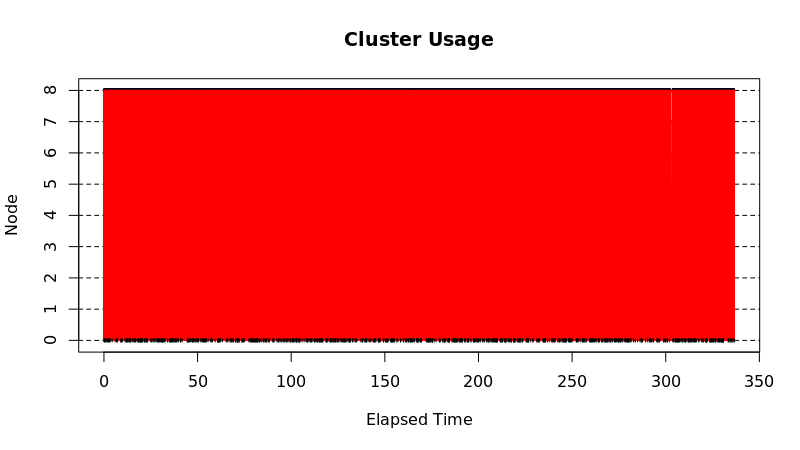
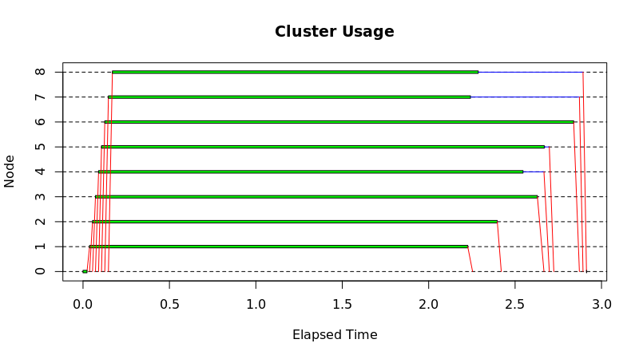
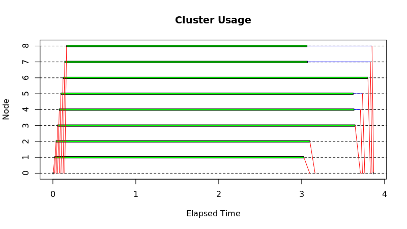

Alle functies binnen de file preProcessing.r maken gebruik van het package [stringi](https://cran.r-project.org/web/packages/stringi/stringi.pdf) om transliteratie op een vector van strings toe te passen.

## Sequentiel

Elke lijn van de vector wordt achter elkaar doorgegeven aan de functie stringi::stri_trans_general.

```{r}
preProcess <- function(text){
  return(stringi::stri_trans_general(text, 'Latin-ASCII'))
}
```


## Parallel

Aangezien lijnen onafhankelijk van elkaar geprocessed kunnen worden, kunnen we hier makkelijk parallel processing op toepassen met behulp van de packages [parallel](https://www.rdocumentation.org/packages/parallel/versions/3.5.2/topics/clusterApply) en [doparallel](https://cran.r-project.org/web/packages/doParallel/doParallel.pdf).


### clusterApply
De eerste manier die we geprobeerd hebben was om lijn per lijn te verdelen naar de cores. Dit bleek behoorlijk inefficient te zijn aangezien er een grote overhead bestond die te wijten was aan communicatie tussen master en slaves. 

```{r}
preProcessCluster <- function() {
  cluster <- makeCluster(no_cores, outfile = "" )
  result <- clusterApply(cl = cluster,x=docs$text,preProcessChunk)
  stopCluster(cluster)
  return(unlist(result))
}
```

#

### clusterApplyChunked
Een oplossing voor de overhead is om eerst de vector in een aantal chunks te gaan verdelen gelijk aan het aantal cores die we te beschikking hebben. Eerst deden we dit door een vector aan te maken van 1 tot het aantal rijen in docs en dan een lijst te maken met subsets van deze vector. op deze manier werd onze code sneller uitgevoerd maar was het geheugen gebruik niet optimaal.  

Oms ons geheugen verbruik te verbeteren zijn we overgeschakeld naar het opsplitsen van de text vector in chunks en deze dan te verdelen over de cores. Op deze manier wordt theoretisch gezien de vector maar 3 keer in geheugen gezet, 1 keer in de originele dataframe, 1 keer in de lijst van chunks en elke core laad nog een chunk in memory.

####Creating chunks

```{r}
createChunksObjects <- function(noChunks){
  chunkList <- list()
  for(i in 1:noChunks){
    #bereken de onder- en bovengrens van de chunk
    og <- round((i-1)*nrow(docs)/noChunks)+1
    bg <- round(nrow(docs)/noChunks*i)
    #Neem een subset en plaats deze in een lijst
    chunkList[[i]] <- unlist(docs[og:bg, "text"])
  }
  
  return(chunkList)
}
```

###Processing chunks
```{r}
preProcessClusterChunked <- function() {
  cluster <- makeCluster(no_cores, outfile="")
  chunks <- createChunksObjects(no_cores)
  result <- unlist(clusterApply(cluster, chunks, preProcessChunk))
  stopCluster(cluster)
  return(result)
}
```

#

##Microbenchmark op elke functie

```{r echo=FALSE}
microbenchmark(preProcessSequential(),
               #preProcessParallel(),
               preProcessParallelChunked(),
               #preProcessDoparallel(),
               preProcessDoparallelChunked(),
               #preProcessCluster(),
               preProcessClusterChunked(),
               times=1)
```

##Bevindingen
* Het parallel uitvoeren van named functions gebruikt minder ram dan wanneer we ze anonymous maken.
* Wanneer we parLappy gaan gebruiken zonder de vector eerst te verdelen in chunks, zien we dat er geen overhead is op vlak van communicatie. Toch is de functie waar we de vector eerst gaan verdelen in chunks een beetje sneller. 

#


